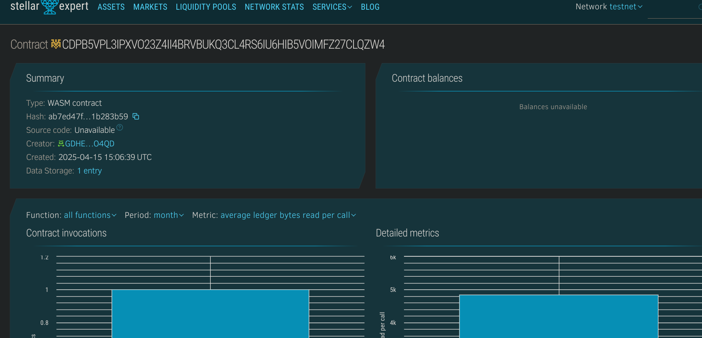

# 📘 Decentralized Login System
 
## 🧾 Project Title
Decentralized Login System

## 📄 Project Description
A minimal login system built using Soroban SDK on Stellar blockchain. It allows users to register and authenticate themselves with hashed passwords in a decentralized manner.

## 🎯 Project Vision
The vision is to eliminate centralized storage vulnerabilities and give users ownership of their login credentials using a transparent and secure decentralized platform.

## 🔑 Key Features
- **User Registration**: Register with a username and password hash.
- **User Login**: Authenticate using password hash comparison.
- **User Lookup**: Retrieve registered usernames.
- **Immutable Storage**: Data is securely stored on-chain using Soroban smart contracts.

## 🌱 Future Scope
- Integration with biometric or multi-factor authentication.
- Password recovery using blockchain-based key recovery.
- Integration with decentralized identity (DID) frameworks.
- Frontend dApp to interact with this smart contract via Stellar wallet.

## 📄 Contract Details:

